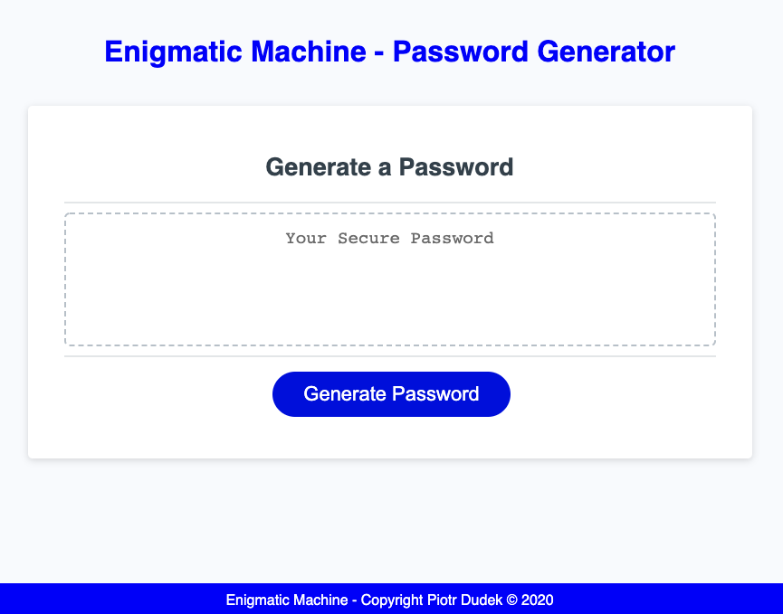

# Enigmatic Machine - Password Generator :rocket:
[](https://opensource.org/licenses/MIT)

## Description
This handy browser password generator creates highly secure passwords based on the criteria stated below

## Table of Contents
* [Installation](#Installation)
* [Usage](#Usage)
* [License](#License)
* [Contributing](#Contributing)
* [Test](#Test)
* [Questions](#Questions)

## Installation
This application will be invoked with the following command:
```
https://piotr72us.github.io/enigmatic-machine/ paste in your search engine :)
```

## Usage
*password length: at least 8 characters and no more than 128 characters, *at least one character type must be included: uppercase, lowercase, numeric, special characters.</br> Enjoy using my password generator! 

## License
This application is covered under the MIT license.

## Contributing
Contributor Covenant

## Test
Testing framework used: Coming soon!

## Questions
If you have additional questions, you can reach me via my GitHub profile: [peterdudek](https://github.com/peterdudek)<br/>
or send me an email at: piotr72@gmail.com
